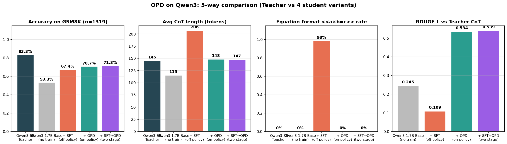

# OPD复现项目

> **方法**：On-Policy Distillation（GKD/JSD），Qwen3-8B → Qwen3-1.7B，数据集 GSM8K
> **硬件**：2×RTX A5000（24 GB）
> **栈**：TRL 0.21 + transformers 4.56 + peft 0.13 + bitsandbytes 0.49 + flash-attn 2.7 (disabled, 见下)
>
> 本仓库以"在真实约束下复现 OPD"为目标，所有耗时 / 显存 / 关键 bug 都来自实测。

---

## 1. 项目结构

```
OnPolicyDistillation_Project/
├── README.md                   ← 本文件，门面
├── opd-qwen3-guide.md          原始指南
├── feasibility-report.md       早期可行性核验
└── opd-qwen/                   实际工作区
    ├── EXPERIMENT_PLAN.md      实验计划 + 结果分支归因
    ├── BENCHMARK.md            压测结果（step 时间 / 显存 / 配置对比）
    ├── scripts/                一键脚本
    │   ├── 00/10/11/20/30 + run_all.sh           Instruct 主线
    │   └── 40/50/51/60     + run_all_base.sh      Base 主线（推荐）
    ├── src/                    训练 / 评测 / 出图代码（--student 切模型）
    ├── runs/                   训练 ckpt + eval 日志
    ├── figs/                   出图（loss / bar / ablation）
    └── models/
        ├── teacher/            Qwen3-8B
        ├── student/            Qwen3-1.7B-Instruct
        └── student-base/       Qwen3-1.7B-Base ← 主线 student
```

## 2. 快速开始

```bash
cd opd-qwen
source .venv/bin/activate

# 主线（推荐）：Base student 
bash scripts/run_all_base.sh   
# 对照：Instruct student → 验证 OPD 防灾难性遗忘
bash scripts/run_all.sh       
```

<!-- 或拆开跑：见 `EXPERIMENT_PLAN.md`。

## 3. 关键修复（之前实验为什么不能用）

| Bug | 表现 | 修复 |
|---|---|---|
| Qwen3 thinking 没关 | OPD 单步 159 s，loss 不下降 | tokenizer wrap 强制 `enable_thinking=False`（见 `src/opd_train.py:108` / `src/sft_baseline.py:33`） |
| teacher_bf16_split 跨卡 | KV cache 跨 PCIe 慢 | 改回 4-bit nf4 单卡 teacher（默认） |
| SFT/OPD 不等 FLOPs | OPD 8.66e15 vs SFT 4.93e15，对照不公平 | SFT 默认 `--max_steps 540` 配 OPD 300 step |
| Instruct student 头空间太小 | baseline 75% / OPD 75.7%，看不出 OPD 价值 | 加 base student 主线（`scripts/{40,50,51,60}_*.sh`） |
| README 是 trl 自动占位符 | "fine-tuned version of None" | 此文件 + EXPERIMENT_PLAN.md 替代 | -->


## 3. 主要结果

### 3.1 Base student 完整对照（**简历主线**）

n=1319 GSM8K test，full eval；ROUGE-L 参考 **真 Qwen3-8B teacher**。

| 模型 | GSM8K acc | tokens | steps | `<<eq>>`率 | ROUGE-L vs Teacher |
|---|---|---|---|---|---|
| Qwen3-8B Teacher                 | **83.3%** | 453 | 17.1 | 0%      | —     |
| Qwen3-1.7B-Base (baseline)       | 53.3%     | 196 | 14.0 | 0%      | 0.245 |
| Qwen3-1.7B-Base + SFT            | 67.4%     | 508 | 47.2 | **98.6%** ⚠️ | 0.109 |
| Qwen3-1.7B-Base + OPD            | 70.7%     | 271 | 18.2 | 0%      | 0.534 |
| **Qwen3-1.7B-Base + SFT→OPD**    | **71.3%** ⭐ | 269 | 18.0 | 0%      | **0.539** |

> **核心发现**：
> 1. **OPD 用 400 step（SFT 的 22.7%）反超 SFT +3.3 pt**，符合 OPD 论文 "compute-efficient" 论点。
> 2. **SFT 学到的是表面格式**：98.6% 输出含 GSM8K 训练集特有的 `<<a*b=c>>` 标记（teacher 不写）；ROUGE-L vs teacher 仅 0.109。
> 3. **OPD 学到的是语义**：ROUGE-L 0.534（5× SFT），CoT 长度 / 步数与 teacher 几乎一致。
> 4. **SFT→OPD 两阶段最佳**：71.3% 反超纯 OPD +0.6 pt；OPD 阶段把 SFT 留下的 98.6% `<<eq>>` **完全洗掉**。

### 3.2 Instruct student 对照（OPD 防灾难性遗忘）

| 模型 | GSM8K acc (n=1319) |
|---|---|
| Qwen3-1.7B-Instruct (baseline)  | 74.7% |
| + SFT                            | **60.7%** ⚠️ 灾难性遗忘 −14 pt |
| + OPD                            | 75.4% (无遗忘) |

→ 已 instruct-tuned 的 student 被 GT-style SFT 覆盖后能力下降；OPD 因目标分布是 teacher 而非 GT，不触发遗忘。

### 3.3 训练超参（与论文对齐）

| 项 | 值 |
|---|---|
| Teacher | Qwen3-8B (bnb 4-bit NF4, ~6 GB) |
| Student | Qwen3-1.7B-Base/Instruct (bf16 + LoRA r=64, α=128) |
| OPD: λ / β / T | 0.5 / 0.5 (JSD) / 0.9 |
| lr / batch | 2e-5 / per_device 2 × grad_accum 4 = 8 |
| max_new_tokens | 256 |
| max_steps (real ckpt) | 1000 启动 / 取 ckpt-400 |
| GPU | 1× A5000 24 GB（teacher 4-bit + student LoRA 共 ~16 GB） |
| 训练耗时 (400 step) | ~3.5 h，35 s/step |

### 3.4 关键工程优化

| 问题 | 解决方案 | 效果 |
|---|---|---|
| Qwen3 chat_template 默认开 `<think>` | 全局 patch tokenizer.apply_chat_template，强制 `enable_thinking=False` | 单步 159s → 35s（**4.5× 加速**） |
| `dump_cot.py` 串行采 N 次 | 改用 `num_return_sequences=N` 一次出 | 评测 **4× 加速** |
| 主线 OPD 用 max_steps=1000 但只取 ckpt-400 | SFT→OPD 续训用同 max_steps + watcher 触发 ckpt-400 SIGINT 自动停 | lr scheduler 严格对齐 |
| TRL `GKDTrainer` 把 `device_map={"":1}` 拉回卡 0 | 接受单卡训练（teacher 4-bit + student LoRA 共占 16 GB，足够） | — |

### 3.5 5-way 对比图



更多图：
- `opd-qwen/figs/cot_5way_acc.png`（acc 单图）
- `opd-qwen/figs/cot_5way_format_vs_semantic.png`（`<<eq>>` 率 vs ROUGE-L）

### 3.6 实验产物索引

| 类型 | 路径 |
|---|---|
| 数值表 (CSV) | `opd-qwen/runs/cot/metrics_5way.csv`、`metrics_auto.csv` |
| 全量 eval 日志 | `opd-qwen/runs/eval/*.log` |
| 训练 LoRA ckpt | `opd-qwen/runs/{sft,opd,opd-on-sft}-qwen3-1.7b-base/` |
| CoT dump (1319×8 模型) | `opd-qwen/runs/cot/{base,sft,opd,sft_then_opd,instruct1p7b,instruct_sft,instruct_opd,teacher}.jsonl` |
| **面试讲述脚本** | `opd-qwen/INTERVIEW_GUIDE.md` |
| 教学版 CoT 指标脚本 | `opd-qwen/src/cot_metrics_annotated.py` |
| 5-way 出图脚本 | `opd-qwen/src/cot_compare_5way.py` |
| 完整文档 | `opd-qwen/RESULTS.md`、`opd-qwen/COT_PLAN.md` |

### 3.7 复现步骤（一键到底）

```bash
cd opd-qwen
# 1) SFT (baseline 路线)
bash scripts/40_train_sft_base.sh                # ~1.7 h
# 2) OPD 主线（max_steps=1000, 取 ckpt-400）
bash scripts/50_train_opd_base.sh                # ~3.5 h
# 3) SFT→OPD 两阶段（merge SFT-LoRA 后再跑 OPD）
python src/merge_lora.py --base models/student-base \
    --lora runs/sft-qwen3-1.7b-base/final \
    --out  models/student-base-sft-merged
bash scripts/52_train_opd_on_sft.sh              # ~3.5 h
# 4) Full eval (n=1319)
python src/eval_gsm8k.py --lora runs/opd-on-sft-1.7b-base/checkpoint-400 ...
# 5) CoT dump + 出图
python src/dump_cot.py  --tag sft_then_opd ...
python src/cot_metrics_annotated.py
python src/cot_compare_5way.py
```
